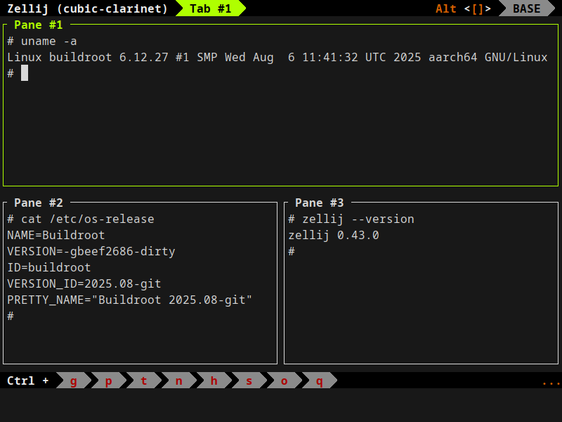
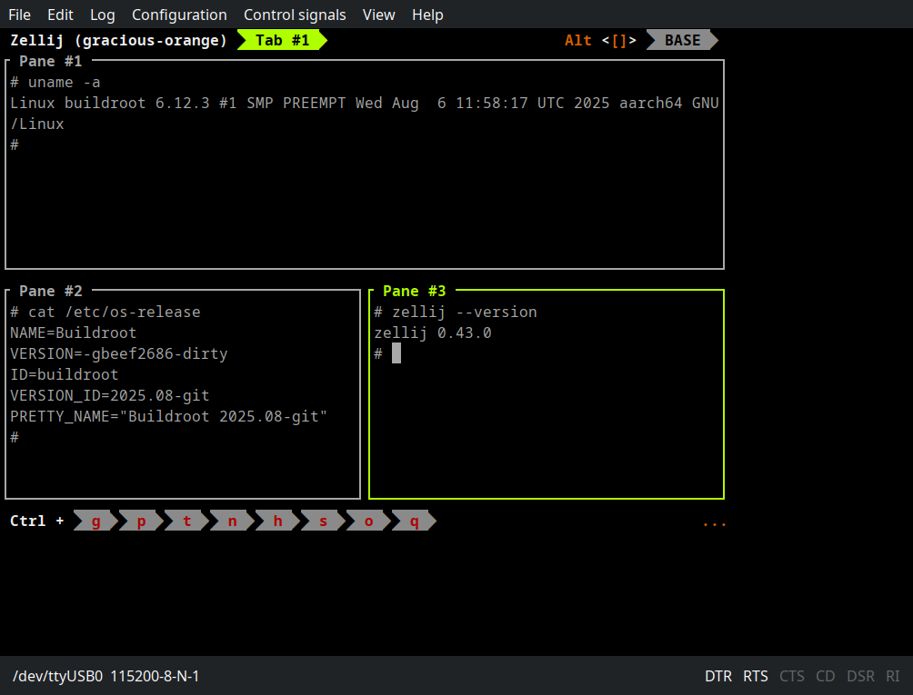

# About

A helper project to integrate [zellij](https://github.com/zellij-org/zellij)
into [Buildroot](https://buildroot.org/). The patches submitted to the Buildroot
team can be found here [here](https://patchwork.ozlabs.org/project/buildroot/list/?series=&submitter=&state=&q=zellij&archive=&delegate=)

# Status

Zellij works on the test platforms: QEMU (AArch64), and Orange Pi (AArch64).
It seems it’s not easy to run it on 32-bit ARM due to limitations of
[cranelift-codegen](https://docs.rs/cranelift-codegen/0.122.0/cranelift_codegen/)
crate.

# Examples

**QEMU aarch64**

**Orange PI Zero**

